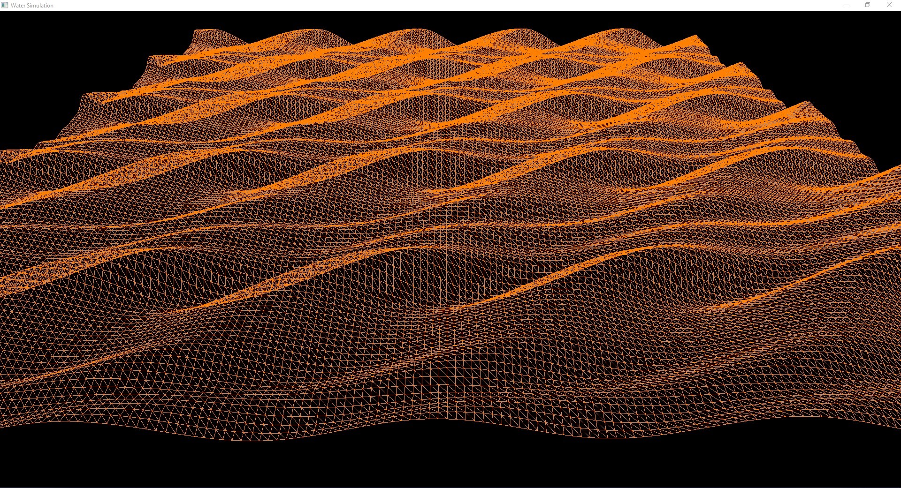

# Water-Simulation

A water simulation based on Acerola's video on Sine Waves to Water.

### Building the project

The project can be built using [premake 5](https://premake.github.io/). To build the  project use the command `premake5 vs2022` for a Visual Studio 2022 Project. Build commands can be found [here](https://premake.github.io/docs/Using-Premake).

### About the project

The project is made to somewhat replicate the "Waves" in Acerola's video "[Turning Sine Waves Into Water](https://youtu.be/PH9q0HNBjT4)". 

This project implements the following systems:

1. [Shader Compilation](#shader-compilation)
2. [Model Loading](#model-loading)
3. [Camera](#camera)

#### Shader Compilation:

The Shader class compiles shaders, and links them to a program. The Shader class has the following public facing functions:

* `Disable()` : This is a **static** function that when invoked disables all shaders that are in use.
* `Use()` : Sets the shader object's program as the active shader.
* `SetFloat(string, float)` : Sets a float uniform within the shader.
* `SetVec3(string, vec3)` : Sets a vec3 uniform within the shader.
* `SetMat4(string, mat4)` : Sets a mat4 uniform within the shader.

> NOTE: vec3 and mat4 are structs from the glm library (glm::vec3 & glm::mat4)

> NOTE: string is the standard library string (std::string)

#### Model Loading:
This is implemented in Mesh.h in the Mesh class. The Mesh class can only, for now, load trianglated Wavefront(.obj) files. These `.obj` file can not be imported if there are Normals, UV Coordinates, or Colors. The class reads the obj file getting the indices and the vertex positions, attaching them to a Vertex Array Object created when the object is created. The Mesh class has the following public facing functions:

* `Draw(shader)` : Draws the mesh using the shader passed in.

#### Camera:
The Camera class is used to control how the scene is viewed. The Camera class has the following public facing functions:

* `GetViewMatrix()` : Returns a view matrix to be used by the shader transform the model to view space.
* `GetPosition()` : Returns the camera's position.
* `SetPosition(vec3)` : Sets the camera's position.
* `Move(vec3)` : Increments the camera's position by the vector3 passed in.
* `GetPitch()` : Returns the camera's pitch.
* `PitchBy(float)` : Increments the camera's pitch by the float passed in and also updates the orientational vectors. (Clamped to be between -89&deg; and 89&deg;)
* `GetYaw()` : Returns the camera's yaw.
* `YawBy(float)` : Increments the camera's yaw by the float passed in and also updates the orientational vectors.
* `GetFront()` : Returns the vector pointing forward based on the camera's orientation.
* `GetRight()` : Returns the vector pointing to the right of the camera based on the orientation.
* `GetUp()` : Returns the vector pointing upward based on the camera's orientation.
* `GetFOV()` : Returns the FOV of the camera. 
* `DecFOV(float)` : Decrements the FOV based on the float passed in. (Clamped to be between 45&deg; and 90&deg;)

> NOTE: vec3 is a struct from the glm library (glm::vec3)

### Usaging the Application

The applications has FPS controls for movement ie WASD. To orient the camera left click and move the mouse. To change the drawing mode use 1/F1, 2/F2, and 3/F3. And finally use the Esc key to exit the application.

